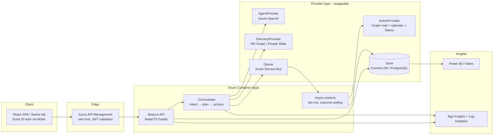

# Beacon — Production Implementation Plan

> Scope: take the validated hackathon prototype (deterministic, local, single-page React) to a production-grade, tenant-deployable **human opportunity router** on Azure. The demo stays untouched; production is a separate app under `production/`.

---

## 1. Guiding principles (carried from the prototype)

1. **Consent-first, always.** No person appears or is contacted without an explicit, revocable opt-in. Recipients can decline any introduction.
2. **Approved signals only.** Skills, languages, availability, certifications, mentoring preference, community membership. Never private messages, never inferred "potential," never a performance/promotion score.
3. **Human in control.** The agent drafts and proposes; a human sends, and a human accepts.
4. **Explainable.** Every recommendation carries a "why," the signals used, and its limitations.
5. **Orchestration, not a new destination.** Beacon activates existing investments (People Skills, Career Hub, Viva, communities) by turning their recommendations into real connections and measured outcomes.
6. **Replaceable seams.** Every external dependency sits behind a provider interface so it can be tested with a fake and swapped for the live service via configuration.

---

## 2. Target architecture

**Runtime:** Azure Container Apps (scale-to-zero, revision-based deploys). **Gateway:** API Management (JWT validation, throttling, product keys). **Identity:** Entra ID; user token on-behalf-of flow for Graph. **Secrets:** Key Vault via managed identity. **Async:** Service Bus for the "connect me to all" fan-out and for polling introduction outcomes. **Observability:** Application Insights + Log Analytics, OpenTelemetry traces end-to-end.

---

## 3. Backend components

### 3.1 API service (`production/api`)
- **Stack:** Node 22 LTS + TypeScript, Fastify, Zod for request/response schemas, Pino logging, OpenTelemetry.
- **Auth:** Entra ID JWT validation middleware (audience + issuer + signature via JWKS). Every route requires a user identity; the caller's object id scopes all reads/writes.
- **Endpoints (v1):**
  - `POST /v1/acceleration/plan` — body: `{ goalId | goalText }` → returns skill signals + ranked opportunities (calls Orchestrator).
  - `POST /v1/acceleration/plan/:id/connect` — fan-out; enqueues one action per opted-in opportunity; returns a `batchId`.
  - `GET /v1/acceleration/batch/:batchId` — status + per-opportunity confirmations.
  - `POST /v1/connect/match` — expert match for an urgent request (topic/language/timeframe).
  - `POST /v1/connect/:matchId/introduce` — draft + send a single introduction.
  - `POST /v1/outcomes` — record an outcome (resolved / partial / follow-up).
  - `GET /v1/impact?filters` — aggregated, RBAC-gated metrics.
  - `GET /v1/me/consent` / `PUT /v1/me/consent` — participant opt-in state and preferences.
- **Cross-cutting:** idempotency keys on all POSTs, request validation, per-tenant rate limits, structured audit log on every consent-affecting action.

### 3.2 Orchestrator (`production/api/src/orchestrator`)
- Deterministic pipeline with pluggable steps: `parseIntent → gatherSignals → score → assemblePlan → draftOutreach`.
- `AgentProvider` used for (a) intent extraction from free text and (b) drafting introduction copy; **the ranking itself stays deterministic and auditable** (no LLM scoring of people).
- Guardrail layer: consent filter, language hard-constraint, exclusion of non-participants, and a policy check that strips any signal not on the approved list.

### 3.3 Provider interfaces (`production/api/src/providers`)
| Interface | Production impl | Fake (tests/local) |
| --- | --- | --- |
| `AgentProvider` | Azure OpenAI (gpt-4o) via `@azure/openai`, managed identity | deterministic canned intents/drafts |
| `DirectoryProvider` | MS Graph + People Skills (`/me/profile`, skills, availability) | seeded synthetic profiles |
| `ActionProvider` | Graph sendMail, calendar `findMeetingTimes`, Teams chat | in-memory recorder |
| `OutcomeStore` | Cosmos DB (SQL API) or PostgreSQL | in-memory / SQLite |
| `EventBus` | Azure Service Bus | in-process emitter |

Selection is by env (`PROVIDER_MODE=live|fake`) so the whole system runs and is fully testable locally with zero Azure dependencies, then flips to live in the cloud.

### 3.4 Async workers (`production/api/src/workers`)
- **Fan-out worker:** consumes `connect.requested` messages, calls `ActionProvider` per opportunity, writes confirmations, emits `connection.created`.
- **Outcome worker:** polls/receives acceptance + meeting events, updates outcome records, feeds Impact aggregates. Retries with backoff; dead-letter on repeated failure.

---

## 4. Data model (store-agnostic)

- **Participant** — `id, aadObjectId, displayName, role, location, languages[], skills[], certifications[], availability, mentoringPreference, communities[], consent{ status, scopes[], updatedAt }`.
- **Goal** — `id, ownerId, title, horizon, skillSignals[]`.
- **Opportunity** — `id, kind, ownerId, title, detail, reason, timeframe, sourceSystem`.
- **Plan** — `id, ownerId, goalId, opportunityIds[], createdAt`.
- **ConnectionRequest** — `id, planId?, fromId, toId, kind, channel, draft, state(draft|sent|accepted|declined|expired), idempotencyKey, timestamps`.
- **Outcome** — `id, connectionId, result, note?, capturedAt` (no employee rating fields, by design).
- **AuditEvent** — `id, actorId, action, subjectId, signalsUsed[], timestamp`.

Indexes: participant by skill+language+consent; connection by owner+state; outcome by time+community for aggregation. Retention + purge job for stale drafts and PII minimization.

---

## 5. Frontend (`production/web`)
- React 19 + TypeScript + Vite, reusing the prototype's Clawpilot theme and components as the visual baseline.
- **MSAL** auth (login, silent token, on-behalf calls to the API). No secrets in the browser.
- Data via a typed API client generated from the OpenAPI spec; React Query for caching/optimistic fan-out UI.
- Same three surfaces — Accelerate (hero), Connect, Impact — now backed by live endpoints, plus a **Consent & transparency** screen (participant opt-in management + "what signals we use").
- Packaged both as a standalone web app and as a **Teams tab** (manifest + SSO) so it meets people where they work.
- Accessibility: WCAG 2.2 AA, keyboard paths, reduced-motion, chart text alternatives (already started in the prototype).

---

## 6. Security, privacy & Responsible AI
- **Identity & access:** Entra ID; least-privilege Graph scopes (`User.Read`, `People.Read`, `Calendars.ReadWrite`, `Mail.Send`, `Chat.ReadWrite`) with admin consent; RBAC roles (employee, mentor, org-admin) enforced server-side.
- **Consent enforcement** at the data layer, not just UI: non-consenting participants are unqueryable.
- **Data protection:** encryption in transit + at rest, Key Vault-managed secrets, managed identities (no keys in code), private endpoints for store and OpenAI.
- **Responsible AI:** approved-signal allowlist enforced in code; deterministic ranking (LLM never scores people); every recommendation is explainable and audit-logged; content safety on generated drafts; human approval before any send. Documented model card + DPIA.
- **Compliance:** audit trail, data-subject export/delete, region-pinned data residency, tenant isolation.
- **Threat model:** OWASP Top 10 review, dependency scanning (Dependabot/`npm audit`), SAST in CI, secret scanning.

---

## 7. Infrastructure as code (`production/infra`, Bicep)
- Resource group per environment (dev/test/prod).
- Modules: Container Apps environment + apps, API Management, Azure OpenAI, Cosmos DB (or Flexible PostgreSQL), Service Bus, Key Vault, Log Analytics + App Insights, Managed Identity, Storage, optional Front Door.
- Parameterized per environment; managed identities wired to Key Vault and OpenAI; private networking where supported.
- `azd` (Azure Developer CLI) template for one-command provision + deploy.

## 8. CI/CD
- **CI:** lint → typecheck → unit tests → build → container build → SAST/dependency scan on every PR.
- **CD:** `azd up` to dev on merge; gated promotion to test then prod with approvals; Container Apps revision-based blue/green with health-probe cutover and automatic rollback.
- Infra changes go through the same pipeline (Bicep what-if on PR).

## 9. Testing strategy
- **Unit:** orchestrator steps, consent/guardrail filters, scoring determinism, provider fakes (Vitest).
- **Contract:** provider interface tests run against both fake and (nightly) live implementations.
- **Integration:** API + store + bus with Testcontainers.
- **E2E:** Playwright across Accelerate/Connect/Impact + consent flows, plus the Teams-tab SSO path.
- **Non-functional:** load test the fan-out path, chaos test worker retries, accessibility audit (axe), security scan.
- Coverage gates in CI; the prototype's existing `matching`/`acceleration` tests port over as the deterministic core.

---

## 10. Delivery milestones

| Phase | Outcome | Key deliverables |
| --- | --- | --- |
| **P0 – Foundations** | Repo, CI, IaC skeleton, auth | `production/` monorepo, Bicep skeleton, Entra app regs, CI pipeline, health endpoints |
| **P1 – Core API (fake providers)** | Full flows working locally, no Azure deps | Orchestrator, all v1 endpoints, store + bus fakes, unit/integration tests green |
| **P2 – Live directory + agent** | Real signals + real drafting | Graph/People Skills `DirectoryProvider`, Azure OpenAI `AgentProvider`, consent enforcement, audit log |
| **P3 – Live actions + async** | Real introductions end-to-end | Graph mail/calendar/Teams `ActionProvider`, Service Bus workers, outcome tracking |
| **P4 – Frontend + Teams** | Production UX on live API | MSAL web app, Teams tab + SSO, consent/transparency screen |
| **P5 – Impact + analytics** | Measured outcomes | Aggregation endpoints, Power BI/Fabric dataset, dashboards |
| **P6 – Hardening + pilot** | Production-ready for HOLA pilot | Security review, load/chaos/a11y tests, DPIA, runbooks, on-call, GA checklist |

## 11. Risks & mitigations
- **Graph/People Skills API limits & permissions** → start with `DirectoryProvider` fake; secure admin consent early; cache signals.
- **LLM cost/latency** → LLM only for intent + drafting, cached; deterministic ranking; token budgets + content safety.
- **Consent complexity across tenants** → enforce at data layer; explicit scopes; audited.
- **Adoption / "another tool"** → Teams-tab surface + orchestration-not-destination positioning.
- **Data residency/compliance** → region-pinned resources, tenant isolation, DPIA before pilot.

## 12. What "done" means for the pilot
A HOLA-scoped tenant deployment where a real employee sets a goal, receives an explainable plan from approved signals, triggers consent-based introductions that land in real Teams/Outlook, records outcomes, and where org admins see measured reach and capacity gaps — with a full audit trail and no employee scoring anywhere in the system.
